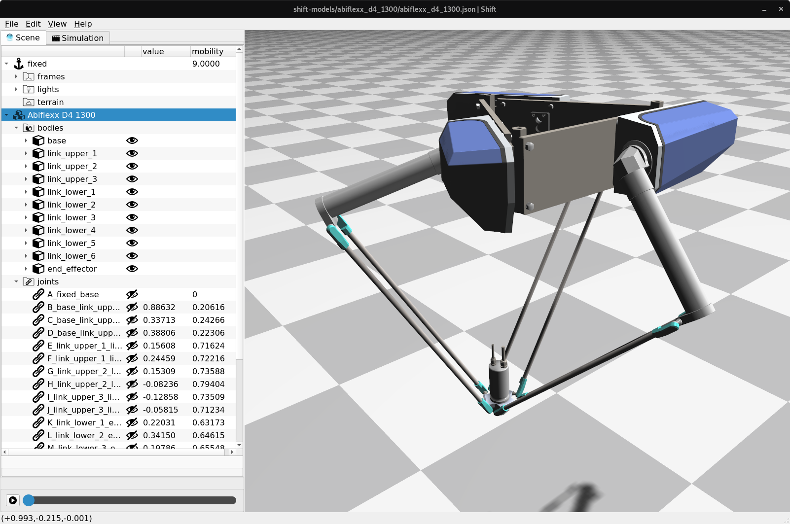

Abiflexx D4-1300
----------------

This folder contains a model of the Abiflexx D4-1300 Delta robot. The model contains 3 revolute joints and 12 spherical joints (represented using quaternions) for a total of 39 degrees of freedom.  Due to the fact that the six lower links are connected with spherical joints at both ends, the model contains six idle degrees of freedom (i.e. lower link can rotate about its long axis without changing the position of the end-effector).

The Jacobian matrix for the model (without an additional constraint imposed to control the position of the end-effector in task space) contains 30 rows and 39 columns. The Jacobian matrix has a rank of 30. The mechanism has a global mobility of nine (three dof for the end-effector and one idle dof for each lower link).

More information is available at `<http://www.abi.nl/en/products-and-services/products/robotics/abif/>`_
