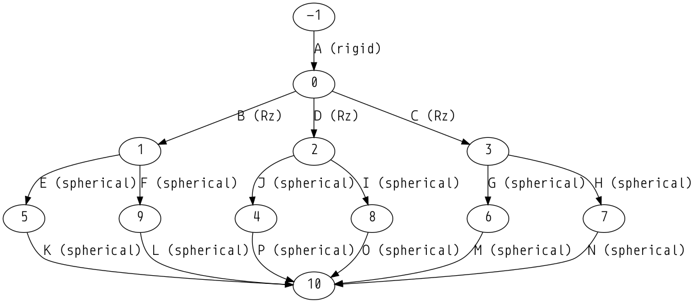

Abiflexx D4-1300
----------------

This folder contains a model of the Abiflexx D4-1300 Delta robot, a robot commonly used for high speed pick-and-place operations. The model contains 3 revolute joints and 12 spherical joints (represented using quaternions) for a total of 39 degrees of freedom.  

.. image:: abiflexx_d4_1300.png

To load the model into the *Shift* software, bodies and joints are specified as a list in a `JSON <http://shift-dynamics.io/file_format/file_format.html>`_ input file. Internal loops are identified automatically by the *Shift* software as shown below:

The Jacobian matrix for the model (without an additional constraint imposed to control the position of the end-effector in task space) contains 30 rows and 39 columns. The Jacobian matrix has a rank of 30. The mechanism has a global mobility of nine (three dof for the end-effector and one idle dof for each lower link).

For more information about the Abiflexx robot, refer to their website at `<http://www.abi.nl/en/products-and-services/products/robotics/abif/>`_
