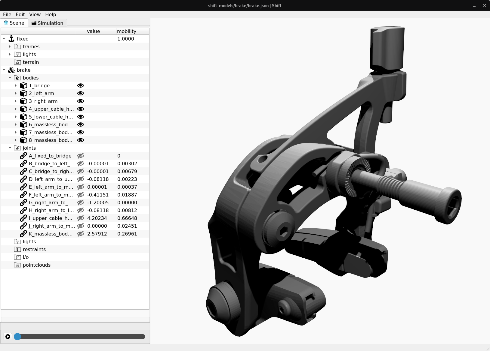
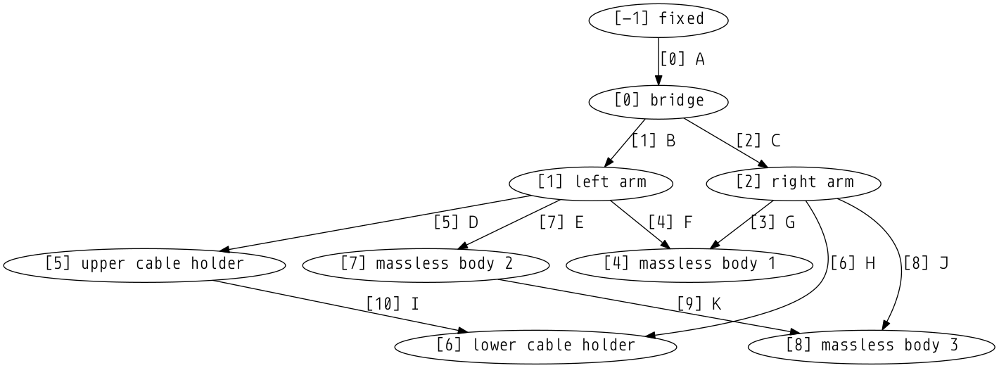
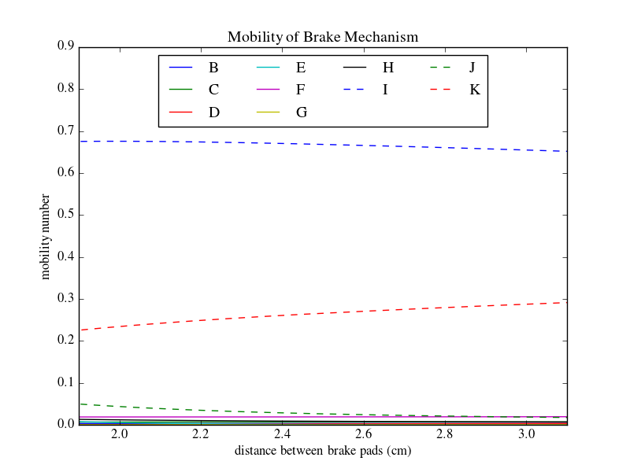
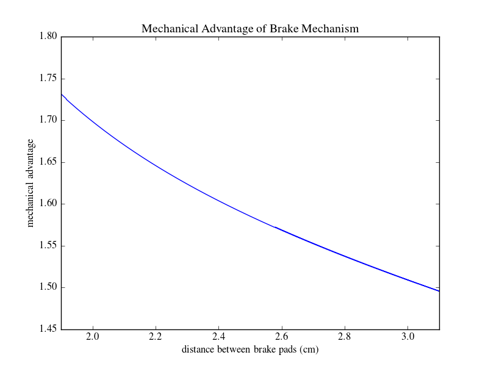

Bicycle Caliper Brake
---------------------

This folder contains a model of a bicycle caliper brake.
Shift has tools to analyze each joint’s contribution to overall mechanism mobility, compute mechanical advantages and to interactively position models in a 3D environment.

In the brake model, the cable and distance between brake pads are modeled as prismatic joints. The bicycle brake has three independent closed internal topological loops and one degree of freedom. Models are specifying a number of bodies and joints in a `JSON <http://shift-dynamics.io/file_format/file_format.html>`_ input file. Topological loops, if they exist, are discovered automatically by the software.

Additionally, *Shift* has tools to efficiently calculate each joint's contribution to overall instantaneous mobility. This 1DOF system has an overall instantaneous mobility of 1. The overall mobility is shared between all of the joints as shown below.

Here, joints I and K represent the inputs and outputs of the mechanical linkage, and have the greatest ability to effect a change in the brake's configuration.

Mobility numbers are closely related to mechanical advantages. For a 1DOF system, mechanical advantages can be obtained by taking ratios of mobility numbers as shown below.

