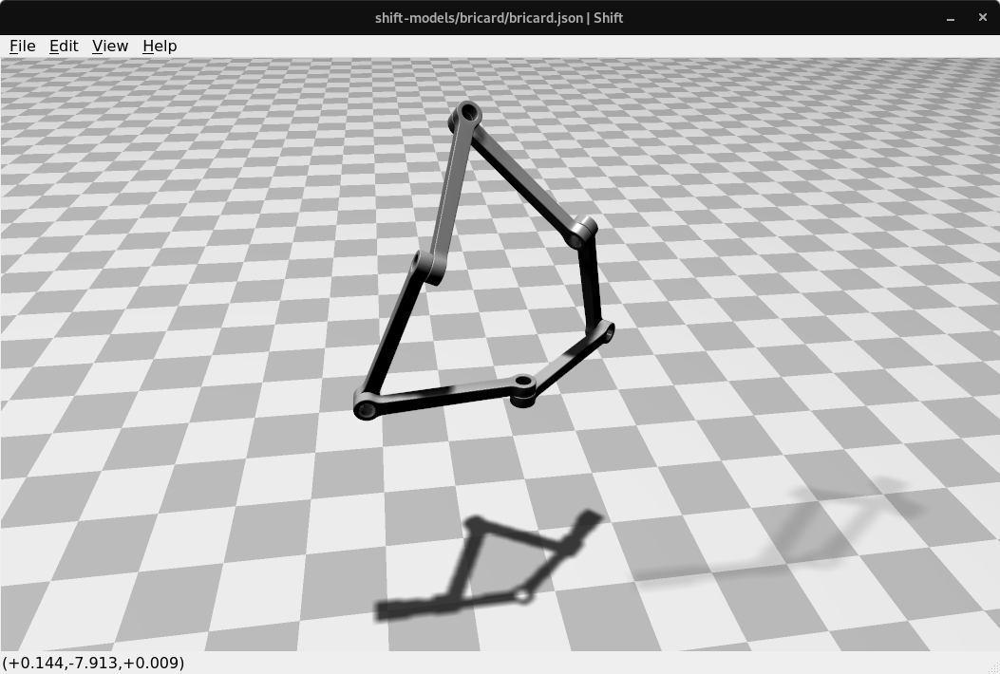

Bricard's mechanism
-------------------

Bricard's mechanism is an example of an overconstrained, paradoxical mechanism. When the mechanism assumes a planar configuration, the joints at the three corners have no ability to impart a change on overall system configuration; the system can only be actuated by the joints positioned along the edges. As the system changes configuration, the joints at the corners transition to the edges and vice-versa. Therefore, it is not possible to parameterize its motion by any single joint through the entire range of motion.

The paradoxical nature of Bricard's mechanism poses a modelling challenge for multibody dynamics formulations. Any multibody dynamics formulation that applies *Generalized Coordinate Partitioning (GCP)* only once at the beginning of simulation execution would fail for this mechanism. On the other hand, methods that apply GCP using the LU, QR or SVD decomposition methods for GCP at every time interval during numerical integration pay a substantial performance penalty, with the LU decomposition method requiring the least overhead of the three methods.

*Shift* uses a novel heuristic application of GCP, performing LU decomposition with complete pivoting on an as-needed basis during a running simulation. This approach offers an excellent combination of execution speed and generality. *Shift's* dynamics solver is capable of simulating Bricard's mechanism many times faster than real-time.
