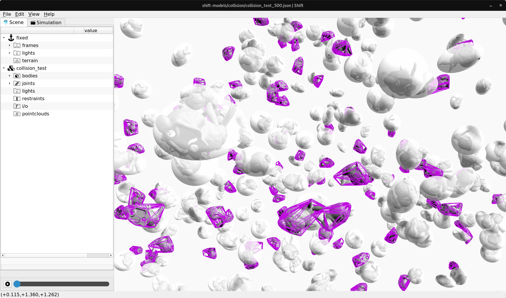

Collision modeling
------------------

Currently in development is the ability to model collisions using mesh-to-mesh contact, minimum bounding spheres, minimum bounding ellipsoids or convex hulls. Collision geometries are computed automatically when models are initially loaded. 

