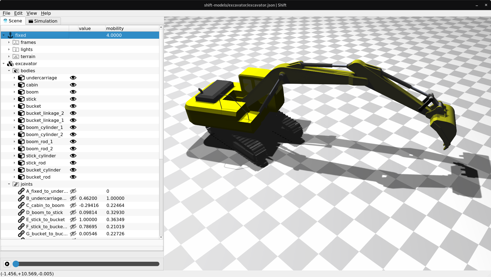
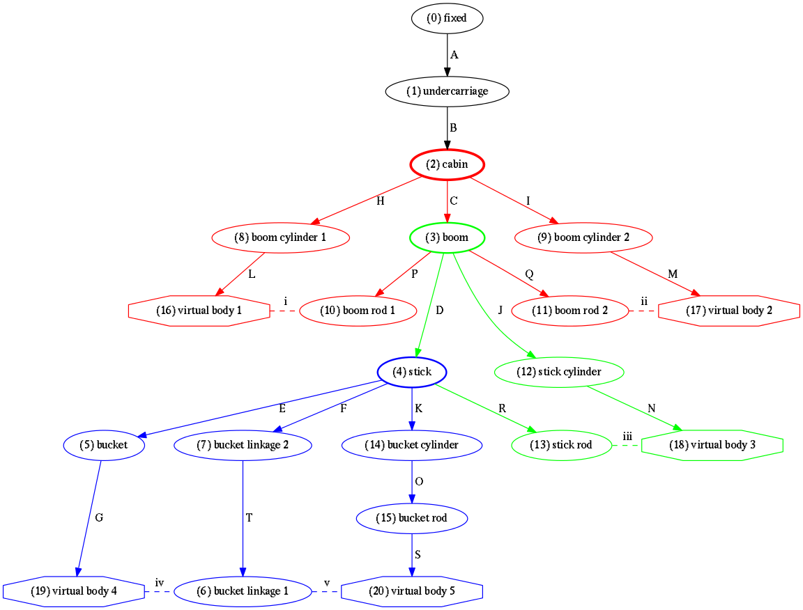

Excavator
=========

This directory contains the hydraulic excavator model used in the paper *Generalized Coordinate Partitioning for Complex Mechanisms based on Kinematic Substructuring*.

The excavator has five independent kinematic chord loops and three non-overlapping clusters of kinematic chord loops. The kinematic loops and *kinematic substructures* (highlighted in red, green and blue below) are identified automatically by the *Shift* software.

Once the bodies and joints have been reordered according to their substructure assignments, the Jacobian matrix can be block-diagonalized, allowing for an approximate order of magnitude reduction in FLOPs required for applying GCP to this system.
