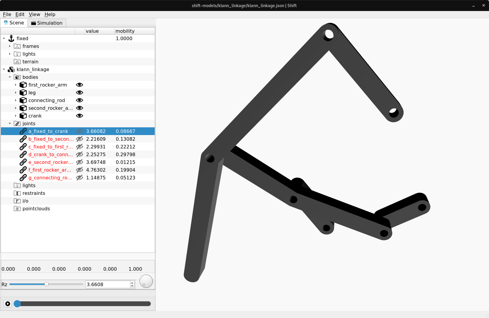
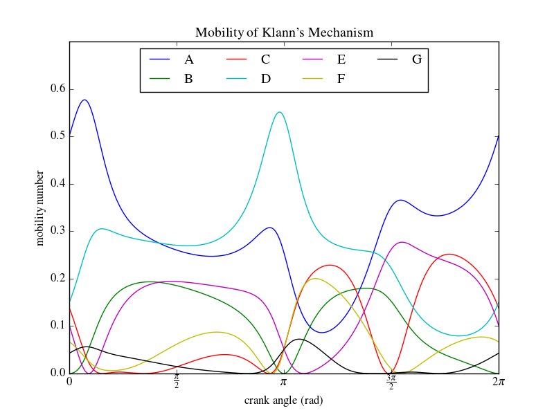

Klann linkage
-------------

Klann's linkage, named for its designer Joseph Klann, is a planar multiloop mechanism designed to simulate the gait of a legged animal. The walking motion is actuated by a single input crank. The crank rotation is transferred to a connecting arm, which causes the leg to move in an arcuate reciprocating motion along a restricted path.

The *Shift* software can be used to assemble and animate the linkage and inspect the contribution of each of the joints to the overall instantaneous mobility.

