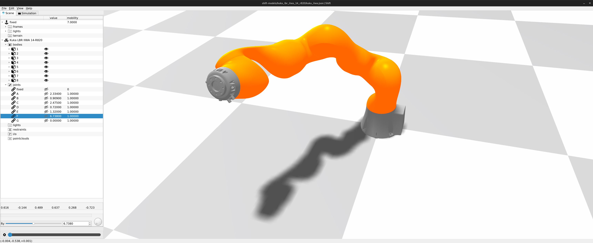

Kuka LBR IIWA 14 R820
---------------------

This folder contains a model of the 7DOF Kuka IIWA 14 R820 "Cobot" derived from `<https://grabcad.com/library/robot-kuka-lbr-iiwa-14-r820-1>`_

Refer to my recent paper *An algorithm for trajectory generation in redundant manipulators with joint transmission accommodation* for more details about a new efficient approach to resolving redundancy in 7R robots.

For more information about the Kuka robot, refer to Kuka's website at `<https://www.kuka.com/en-de/products/robot-systems/industrial-robots/lbr-iiwa>`_
