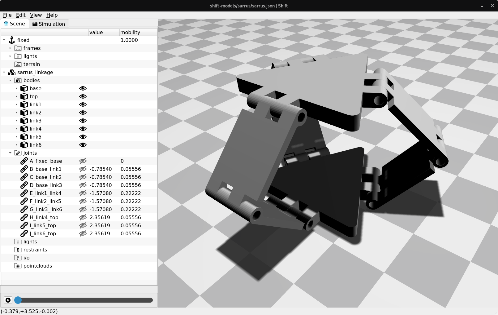

Sarrus linkage
==============

This directory contains a *Shift* `JSON <http://shift-dynamics.io/file_format/file_format.html>`_ model definition file of the Sarrus linkage, an example of a multiloop mechanism.

The Sarrus linkage has an instantaneous mobility of one. Each joint's contribution to overall mobility remains constant throughout the range of motion for this symmetric mechanism. The  joints located at the top and bottom of the base each have a mobility of 1/18. The joints located half-way between the top and base each have a mobility of 2/9.
