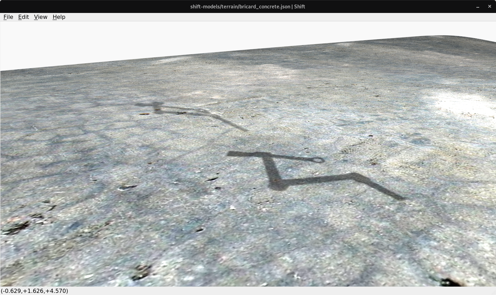

Terrain
=======

This directory contains *Shift* `JSON <http://shift-dynamics.io/file_format/file_format.html>`_ model files that demonstrate the display of terrains (i.e. digital elevation maps). In *Shift*, terrains are loaded from raster image data specified in the floating point TIFF format.

Diffuse, specular and bump map textures can be applied to terrain to provide realistic visual detail. Additionally, *Shift* has custom OpenGL Shading Language (GLSL) programs for Phong shading and dynamic shadow mapping.
