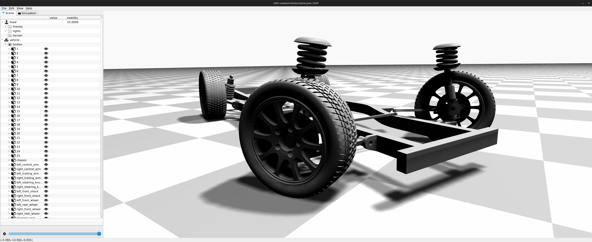
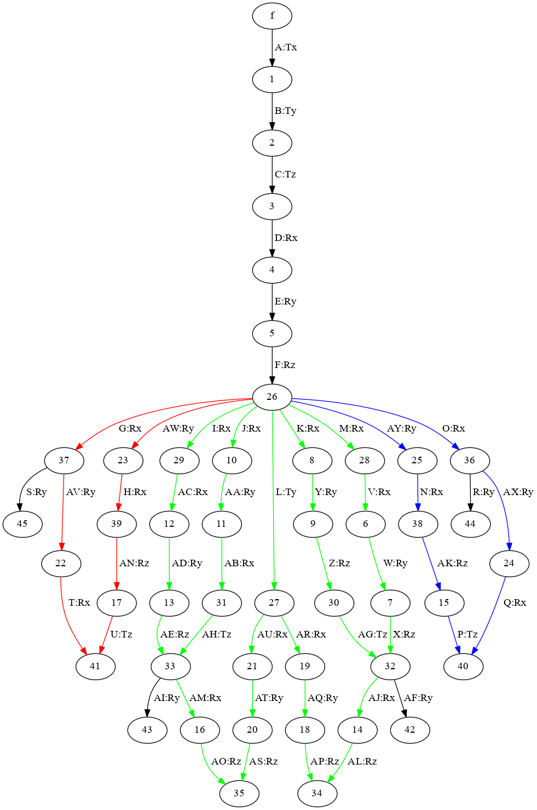

Vehicle Chassis
===============

This directory contains model files for a generic passenger vehicle chassis with McPherson front suspension and semi-trailing link rear suspension.

The vehicle chassis contains six independent kinematic chord loops and three *kinematic substructures* that are identified automatically by the *Shift* software.

For further information, refer to `<https://search.proquest.com/openview/2b96ee91ebc96f840bdada69a21b7cbe>`_
